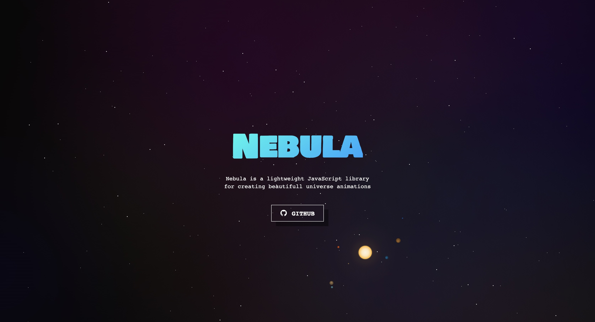

## Nebula
### Nebula is a lightweight JavaScript library for creating univers animations with React.
Including configurable Stars, Nebulas, Comets, Planets and Suns.  
Compatible with SSR



### `Installation`
```
npm install @flodlc/nebula
```

### `Usage`
```
<ReactNebula config={config}/>
```

### `Config`
key | option type / notes | default
----|---------|------
`astres` | `AstreDescription[]` | `[]`
`scale` | `number` | `1`
`speed` | `number` | `1`
`starsCount` | `number` | `200`
`starsColor` | `string` | `#ffffff` (white)
`starsRotationSpeed` | `number` | `5`
`cometFrequence` | `number` | `3`
`nebulasIntensity` | `number` | `8`
`nebulasColors` | `string[]` accept rgb and hex | `["rgb(5,63,157)", "rgb(42,112,25)", "rgb(182,41,44)"]`
